# AI Working Environment

> How the toolchain fits together and how work actually gets done.

---

## The Interface: pi + Claude Code

Everything runs through **pi** — a local coding agent harness that wraps Claude Code (Anthropic's agentic tool). The terminal is the primary interface. There's no separate web app, no prompt playground. Work happens in the same terminal session as the code.

**Model**: claude-opus-4-5. Extended thinking always on, effort level high. The session runs in fullscreen TUI mode.

**What "agentic" means here**: the agent reads files, runs shell commands, edits code, calls web APIs, opens browsers, manages git, creates PRs, and spawns subagents — all in a single session. The human sets direction; the agent drives.

**Permission model**: almost everything is open by default. The hard-denies are baked in (`sudo`, `git push --force`, `rm -rf /`). The actual safety control surface is the guardian (below), not the permissions list.

---

## The Hook Pipeline

Every `Bash` call passes through two layers before and after execution.

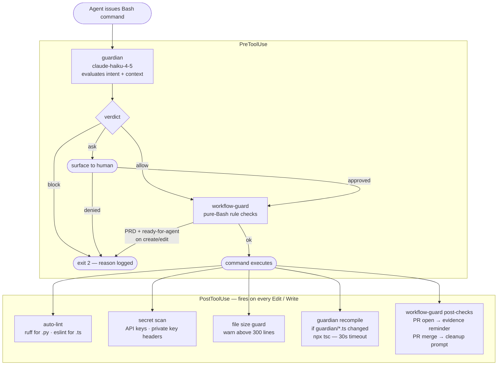

### The Guardian

TypeScript program compiled to `dist/cli.js`. Calls claude-haiku-4-5 to evaluate the command against session context and a rule set. Three outcomes: **allow** (silent), **block** (hard exit + logged reason), **ask** (surface to human).

**Why haiku**: runs on every command — ~200ms hot. Fast enough to not interrupt flow; accurate enough on things that matter.

**Why precompiled**: swapped from tsx (JIT) to precompiled `dist/cli.js`. Saves ~200ms per call. Also removed the esbuild transitive CVE. Dependencies: `@anthropic-ai/sdk` + `zod` only, zero known vulnerabilities.

**Auto-recompile**: PostToolUse detects changes to `guardian/*.ts`, runs `npx tsc`, reports `"Guardian compile FAILED — dist/ is stale"` loudly on error.

### Workflow Guard

Pure-Bash hook (no LLM). Enforces workflow protocol:

- **Pre**: blocks `ready-for-agent` label on PRD-parent issues
- **Post PR open**: warns not to claim CI success from exit code alone
- **Post PR merge**: runs `git status` + `git worktree list`, prompts cleanup-delivery

---

## The Skills Library

~90 skills in `~/.config/agents/skills/` (agent-neutral shared source; also reachable via `~/.claude/skills/`). A skill is a Markdown file with YAML frontmatter — model, reasoning level, contract (inputs/outputs/side effects), and a step-by-step playbook. Skills are executable protocols, not prompts.

Every multi-step skill opens with a **step ledger** and maintains it throughout:

```
WORKFLOW_STEPS:
| Step     | Required? | Status    | Evidence           |
|----------|-----------|-----------|--------------------|
| diagnose | required  | completed | docs/diag-xyz.md   |
| fix      | required  | pending   | -                  |
| verify   | required  | pending   | -                  |
```

Required steps can't be silently skipped — they become `blocked` and the workflow halts.

---

## Workflow Routing

**`workflow-router`** is the single entry point. It classifies the task, presents a `ROUTE_CARD` for human confirmation, runs preflight, then dispatches. Nothing bypasses it.

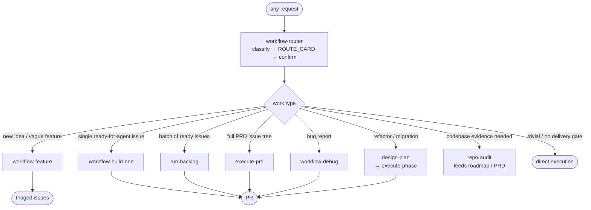

---

## Feature Development: `workflow-feature`

Turns a vague idea into triaged, ready-to-implement issues. **Stops before implementation** — produces the work, doesn't execute it.

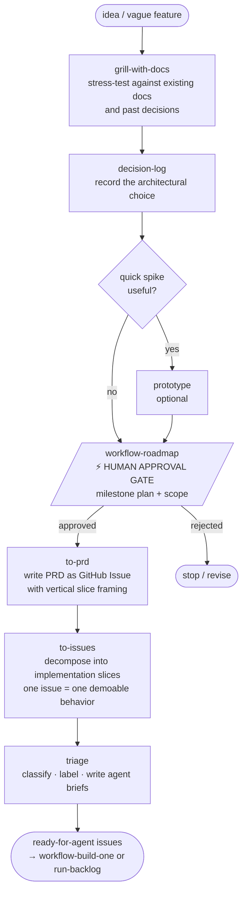

---

## Building One Thing: `workflow-build-one`

The standard workhorse. Drives a single `ready-for-agent` issue from a clean worktree to a merged PR.

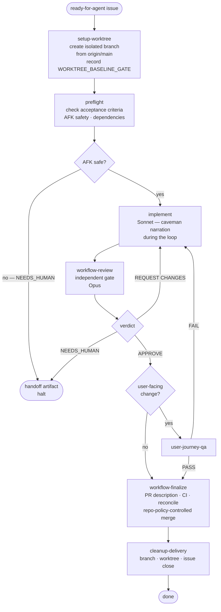

**Model split**: implementation runs on Sonnet (fast). Review runs on Opus (judgment-heavy). Narration during the implementation loop is compressed ("caveman mode") — terse, no filler. Full prose returns for findings, blockers, and the final summary.

---

## AFK Batch: `run-backlog`

Batch-processes all `ready-for-agent` issues without human supervision.

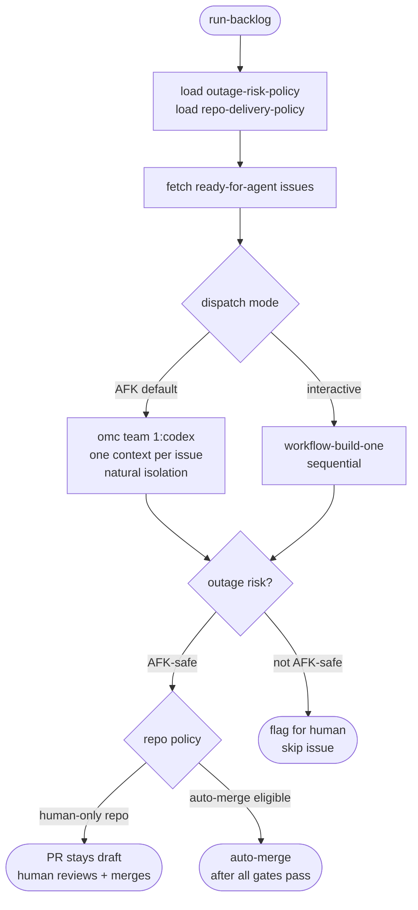

Each issue gets its own context window via Codex dispatch — no cross-contamination between issues. The `outage-risk-policy` file (per-repo) determines AFK safety; a `priority` label cannot override it.

---

## Full PRD Tree: `execute-prd`

Drives an entire PRD from analysis through delivery — handles dependent, ordered, parent-aware execution.

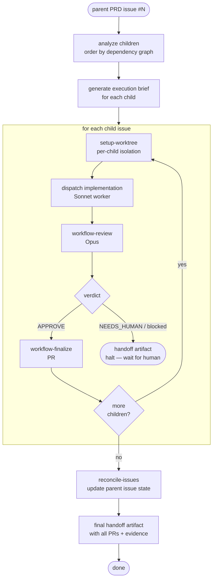

Each child issue gets its own worktree — parallel or sequential depending on dependencies. Every halt produces a handoff artifact that a fresh session can resume from cold.

---

## Bug Work: `workflow-debug`

Cardinal rule: **all bug work begins with `diagnose`**, no exceptions — even if the fix is obvious.

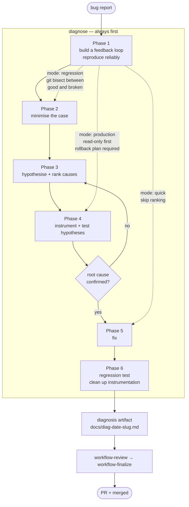

The diagnosis artifact is evidence — it proves understanding and prevents wrong fixes. Modes: **quick** (single likely cause), **standard** (full loop), **deep** (extended instrumentation), **production** (read-only first, rollback required), **regression** (bisect from known-good).

---

## Review + Delivery

`workflow-review` and `workflow-finalize` are mandatory for every code change. Green CI, GitHub reviews, and PR comments do not substitute.

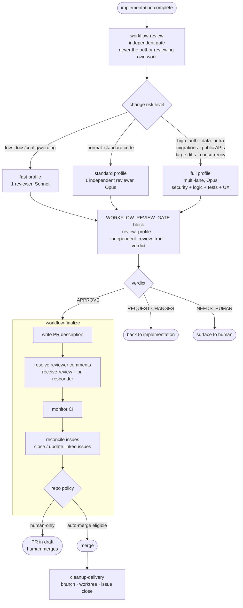

**workflow-finalize will not proceed** without a complete `WORKFLOW_REVIEW_GATE` block from an independent reviewer with `verdict: APPROVE`. If the change was made in the primary checkout instead of a worktree, it also halts.

---

## Handling Incoming Review: `receive-review` + `pr-responder`

When review comments land (bot or human), two skills work through the queue.

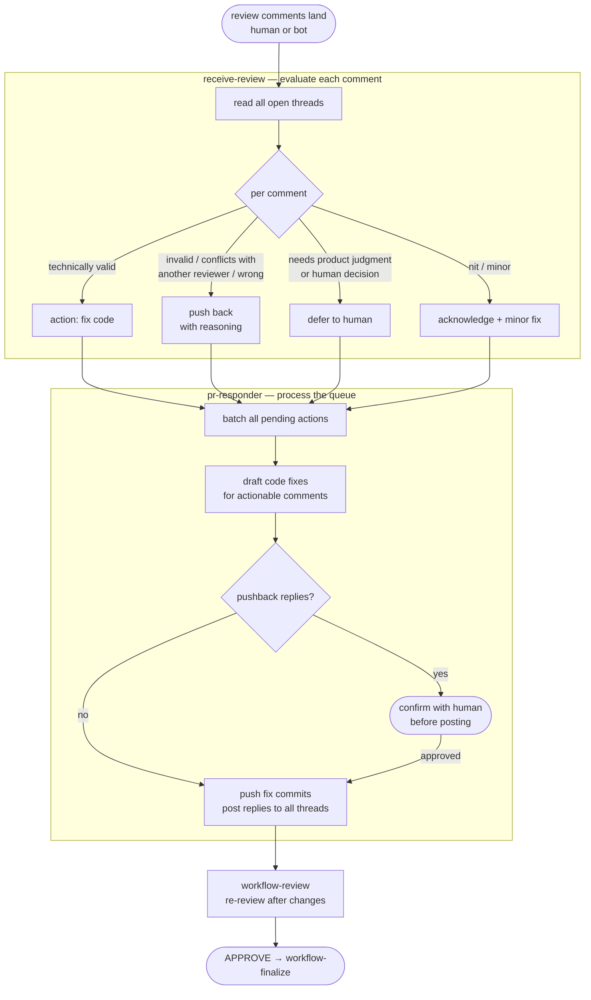

`receive-review` evaluates correctness — it doesn't blindly agree. Suggestions that are technically wrong, conflict with other reviewers, or contradict project invariants get a reasoned pushback. Human reviewer disagreements surface to Alex before any reply goes out.

---

## Architecture + Codebase Work

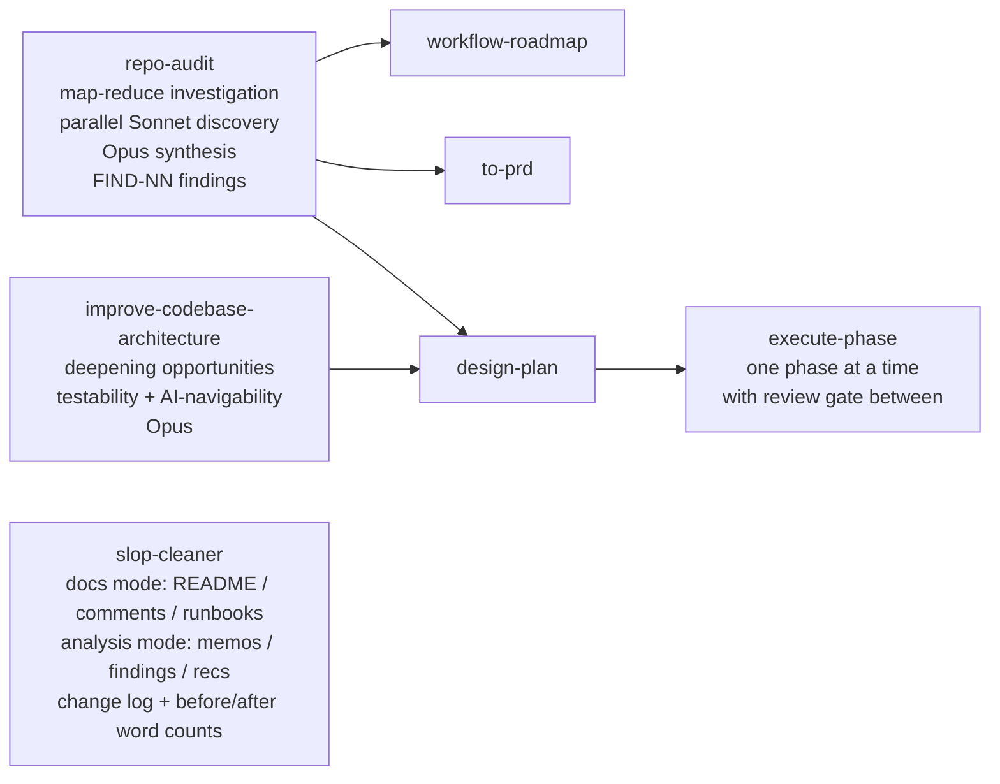

---

## Handoff: Universal Exit Protocol

Every workflow that halts with remaining work produces a **handoff artifact**. The handoff is what makes AFK execution recoverable — a fresh session can resume without rebuilding context.

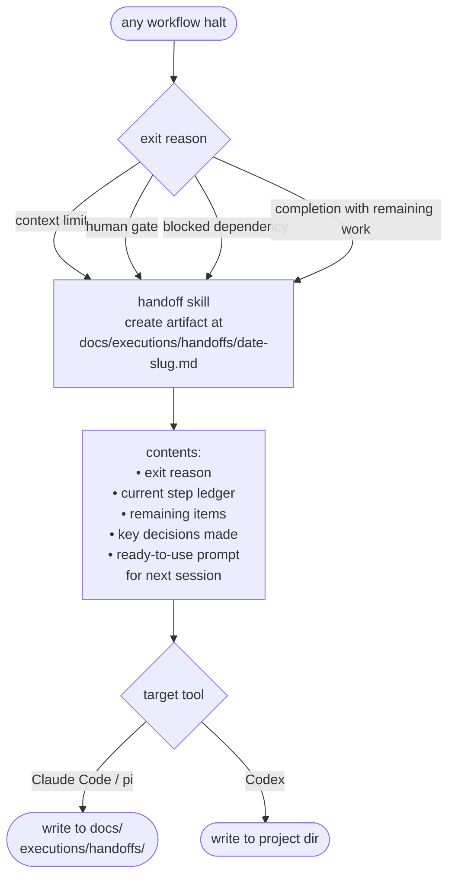

---

## Worktrees: Isolation Pattern

Every implementation runs in an isolated git worktree. `workflow-finalize` enforces this — it halts if the change was made in the primary checkout.

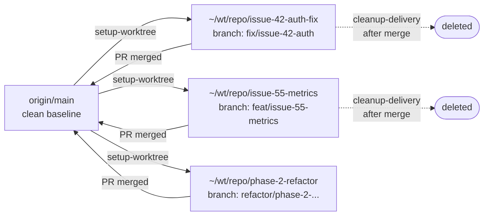

Each worktree records `WORKFLOW_BASE_GATE` + `WORKTREE_BASELINE_GATE` evidence before the first code change. Stacked worktrees (child branch targeting a parent branch) are allowed — `workflow-finalize` checks for `STACKED_WORKTREE_GATE` instead.

---

## Herdr: Workspace Layout

**herdr** is a terminal multiplexer + session manager. The `hdev` command creates a structured workspace:

```bash
hdev ~/projects/myapp          # full layout
hdev ~/projects/myapp --monitor  # gh-dash only
hdev ~/projects/myapp --minimal  # pi only
```

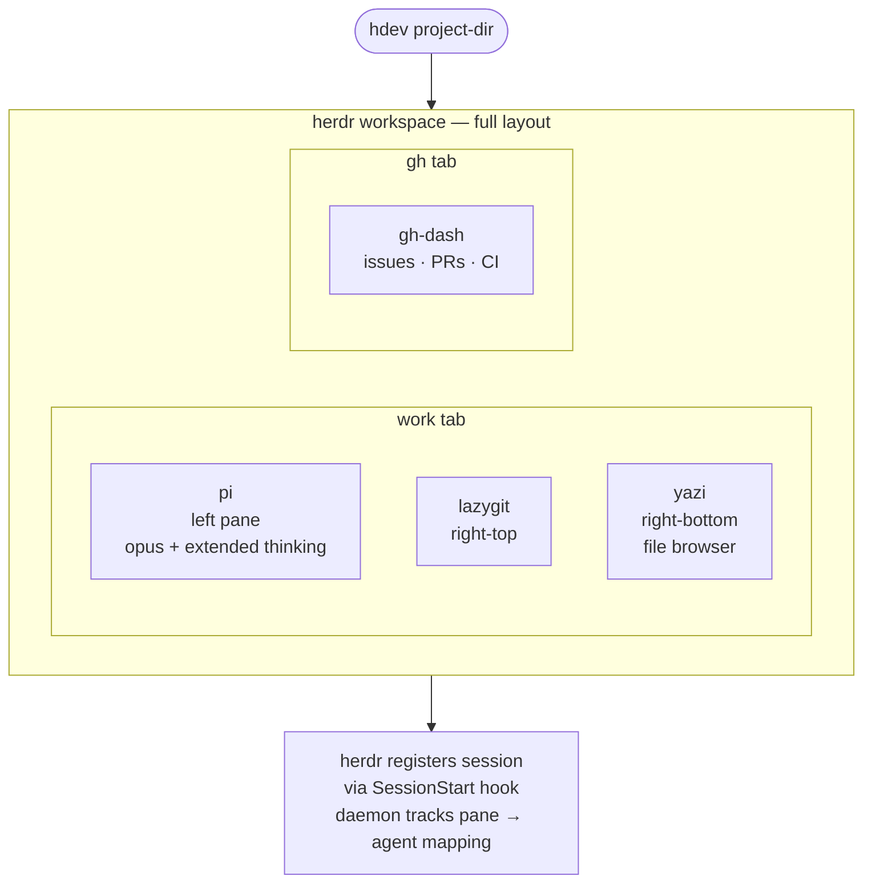

Every AI session (pi, Claude Code, Codex, opencode) registers with the herdr daemon on start. The daemon knows what's running in which pane — workspace-aware tooling.

---

## Pi Packages

26 packages. Grouped by what they enable:

**Codebase navigation**

- `pi-codemapper` — indexes the codebase (symbols, call graphs, dependencies); `map`, `search`, `outline`, `expand`, `path` operations
- `pi-lens` — LSP diagnostics, ast-grep structural search, tree-sitter rules; runs against the live language server

**Subagent orchestration**

- `pi-fork` — spawns subagents at configurable effort levels (fast/balanced/deep → haiku/sonnet/opus)
- `pi-taskflow` — orchestrates multi-agent DAGs (parallel branches, sequential chains, gated phases, map-reduce)

**Memory + context**

- `pi-observational-memory` — compresses session learnings into cross-session observations; runs on haiku
- `pi-context-cap` — warns approaching context limits
- `pi-context-inspector` — shows context composition

**Guardrails**

- `pi-dirty-repo-guard` — blocks writes on repos with uncommitted changes
- `pi-permission-gate` — confirmation prompts for destructive operations
- `pi-codex-goal` — tracks a concrete objective through multi-turn sessions

**Output efficiency**

- `pi-hypa` — compresses shell, read, grep, find, and ls output before it reaches context
- `pi-cache-optimizer` — prompt cache optimization
- `pi-better-messages-cache` — message-level caching
- `pix-optimizer` — token optimization pass

**Real-world integration**

- `pi-web-access` — web search and fetch
- `pi-agent-browser-native` — real Playwright-backed browser automation
- `pi-mcp-adapter` — MCP protocol bridge
- `@gotgenes/pi-github-tools` — GitHub MCP tools
- `pi-pr-ally` — PR review and response assistance

**Utility**

- `@narumitw/pi-caffeinate` — prevents macOS sleep during long AFK runs
- `@diegopetrucci/pi-notify` — macOS notifications when the agent needs input or completes

**Model roles**:

| Role | Model | Used for |
|---|---|---|
| fast | claude-haiku-4-5 | Quick lookups, memory compression, subagent fast mode |
| strong / thinker / vision | claude-sonnet-4-6 | Normal exploration, implementation, most subagent work |
| arbiter / reasoner | claude-opus-4-5 | Review, architecture decisions, high-stakes judgment |

**Fork effort → model**:

| Effort | Model | Thinking |
|---|---|---|
| `fast` | haiku-4-5 | off |
| `balanced` (default) | sonnet-4-6 | low |
| `deep` | opus-4-5 | medium |

---

## Claude Code Plugins

25 plugins. Active ones:

| Plugin | What it adds |
|---|---|
| `context7` | Fetches up-to-date library docs mid-session |
| `typescript-lsp` | TypeScript language server — inline errors, go-to-def, rename refactor |
| `pyright-lsp` | Python language server via Pyright |
| `playwright` | Browser test generation and execution |
| `oh-my-claudecode` | HUD status line, session telemetry, team dispatch (AFK batch) |
| `remember` | Persistent session memory across sessions |
| `superpowers` | Extended tool capabilities |
| `code-simplifier` | Surfaces complexity hotspots |
| `data-engineering` | Data pipeline and SQL tooling |
| `frontend-design` | UI/design guidance |
| `git-cleanup` | Dead branches and stale ref cleanup |
| `skill-creator` | Scaffolds new skills |
| `agent-sdk-dev` | Agent SDK development helpers |
| `claude-md-management` | CLAUDE.md context file management |
| `slack` | Slack integration |

---

## The Status Bar

Bottom of every session: **omc HUD** (oh-my-claudecode). Shows token usage, model, and session state. Cache-backed — only re-reads state when something changes.

---

## MCP Server: gbrain

Local MCP server (`~/gbrain-repo`) providing a knowledge graph interface. Runs via bun. Registered in `settings.local.json` (machine-local, not stowed). Gives any session structured query access to a personal knowledge graph.

---

## Idea Capture

```bash
idea "build a metrics alerting layer"   # AI-enriched capture
idea -q "quick note"                    # skip enrichment
```

Calls claude-haiku-4-5 to classify (tool/app/research/business/experiment/...), write a one-sentence pitch, generate tags, and suggest 3 concrete next steps. Result lands as structured frontmatter Markdown in `~/Documents/Home/Idea Bin/`. Fast enough to capture before the thought is gone.

`ideas review` and `ideas promote` move ideas through the downstream pipeline.

---

## Observability

**Langfuse** at `192.168.4.43:3050` (home network) receives traces from every Claude session. Token usage, tool calls, session duration, and model spend visible in a dashboard on the home network.

**pi-observational-memory** produces per-session compressed observations that persist across context resets — a navigable log of what was learned, decided, and done.

---

## Shell + Git

**ZSH** — minimal, modular, no oh-my-zsh. Modules load in order: configs → tools → theme.

**Key tools**:

| Tool | Replaces | Purpose |
|---|---|---|
| `eza` | `ls` | Icons, color, git status |
| `bat` | `cat` | Syntax highlight, line numbers |
| `rg` (ripgrep) | `grep` | Fast search |
| `fd` | `find` | Simpler syntax |
| `fzf` | — | Fuzzy picker for git, branches, history |
| `zoxide` (`j`) | `cd` | Frecency-based directory jump |
| `atuin` | shell history | Cross-session SQLite, Ctrl-R fuzzy |
| `starship` | PS1 | Git-aware prompt |
| `delta` | git diff pager | Side-by-side, line numbers |
| `lazygit` | git CLI | Terminal git UI |

**Git config**:

- `pull.rebase = true`, `fetch.prune = true`, `rebase.autoStash = true`, `push.autoSetupRemote = true`
- Global gitignore: macOS artifacts, Python/JS/TS build output, `.env*`, AWS credentials, Terraform state, `.omc/`, `.serena/`, `**/.claude/settings.local.json`
- Conventional commits via pre-commit hook (`commit-normalize.sh`) in any repo with `pre-commit install`

---

## Fresh Machine Bootstrap

```bash
git clone git@github-personal:johnalexwelch/dotdev.git ~/dotdev
cd ~/dotdev && bash install.sh
# DRY_RUN=1 bash install.sh   → preview without executing
```

Sequence: Homebrew → config dirs (prevents stow tree-folding) → GitHub SSH → macOS defaults → GNU Stow symlinks → guardian clone + compile → gbrain clone → pi packages → herdr integrations.

One manual step post-install: `~/.claude/settings.local.json` is created from template — contains the gbrain MCP path. All credentials are flat files in `$HOME` sourced by `env.zsh`; drop a file and it gets picked up on next shell start.
