# AI Working Environment

> How the toolchain fits together, how work actually gets done, and what's
> installed where. Two parts: **Part 1** is behavioral (the workflow machinery);
> **Part 2** is reference (exact configs, paths, packages). Predates OpenWiki and
> is being folded into `openwiki/` — treat `openwiki/` as source of truth where
> they disagree.

---

## Part 1 — How Work Gets Done

## The Interface: pi + Claude Code

Everything runs through **pi** — a local coding agent harness that wraps Claude Code (Anthropic's agentic tool). The terminal is the primary interface. There's no separate web app, no prompt playground. Work happens in the same terminal session as the code.

**Model**: claude-opus-4-5. Extended thinking always on, effort level high. The session runs in fullscreen TUI mode.

**What "agentic" means here**: the agent reads files, runs shell commands, edits code, calls web APIs, opens browsers, manages git, creates PRs, and spawns subagents — all in a single session. The human sets direction; the agent drives.

**Permission model**: almost everything is open by default. The hard-denies are baked in (`sudo`, `git push --force`, `rm -rf /`). The actual safety control surface is the guardian (below), not the permissions list.

---

## The Hook Pipeline

Every `Bash` call passes through two layers before and after execution.

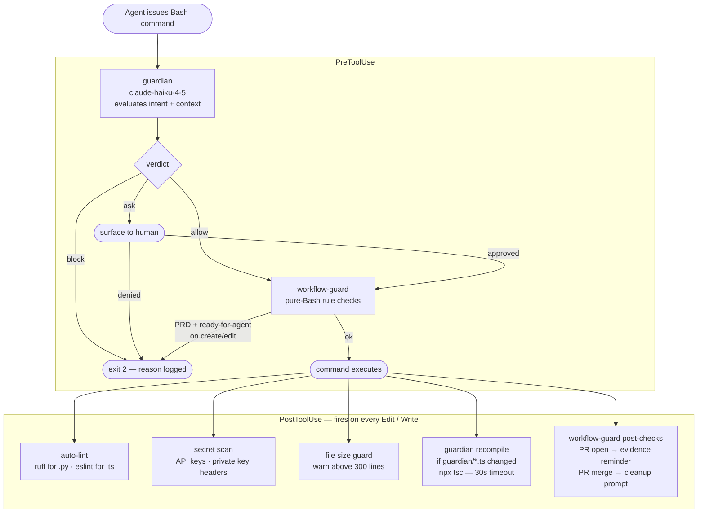
```mermaid
flowchart TD
    A([Agent issues Bash command]) --> B

    subgraph PRE [PreToolUse]
        B[guardian\nclaude-haiku-4-5\nevaluates intent + context]
        B --> C{verdict}
        C -->|allow| D[workflow-guard\npure-Bash rule checks]
        C -->|block| STOP1([exit 2 — reason logged])
        C -->|ask| E([surface to human])
        E -->|approved| D
        E -->|denied| STOP1
        D -->|PRD + ready-for-agent\non create/edit| STOP1
        D -->|ok| EXEC
    end

    EXEC([command executes])

    subgraph POST [PostToolUse — fires on every Edit / Write]
        F[auto-lint\nruff for .py · eslint for .ts]
        G[secret scan\nAPI keys · private key headers]
        H[file size guard\nwarn above 300 lines]
        I[guardian recompile\nif guardian/*.ts changed\nnpx tsc — 30s timeout]
        J[workflow-guard post-checks\nPR open → evidence reminder\nPR merge → cleanup prompt]
    end

    EXEC --> F & G & H & J
    EXEC --> I
```

### The Guardian

TypeScript program compiled to `dist/cli.js`. Calls claude-haiku-4-5 to evaluate the command against session context and a rule set. Three outcomes: **allow** (silent), **block** (hard exit + logged reason), **ask** (surface to human).

**Why haiku**: runs on every command — ~200ms hot. Fast enough to not interrupt flow; accurate enough on things that matter.

**Why precompiled**: swapped from tsx (JIT) to precompiled `dist/cli.js`. Saves ~200ms per call. Also removed the esbuild transitive CVE. Dependencies: `@anthropic-ai/sdk` + `zod` only, zero known vulnerabilities.

**Auto-recompile**: PostToolUse detects changes to `guardian/*.ts`, runs `npx tsc`, reports `"Guardian compile FAILED — dist/ is stale"` loudly on error.

Exact location / clone / runtime facts are in Part 2 → *Claude Code config*.

### Workflow Guard

Pure-Bash hook (no LLM). Enforces workflow protocol:

- **Pre**: blocks `ready-for-agent` label on PRD-parent issues
- **Post PR open**: warns not to claim CI success from exit code alone
- **Post PR merge**: runs `git status` + `git worktree list`, prompts cleanup-delivery

---

## The Skills Library

98 skills in `~/.config/agents/skills/` (agent-neutral shared source; also reachable via `~/.claude/skills/`, symlinked by `ai-setup.sh`). A skill is a Markdown file with YAML frontmatter — model, reasoning level, contract (inputs/outputs/side effects), and a step-by-step playbook. Skills are executable protocols, not prompts. (Skill inventory by category is in Part 2.)

Every multi-step skill opens with a **step ledger** and maintains it throughout:

```
WORKFLOW_STEPS:
| Step     | Required? | Status    | Evidence           |
|----------|-----------|-----------|--------------------|
| diagnose | required  | completed | docs/diag-xyz.md   |
| fix      | required  | pending   | -                  |
| verify   | required  | pending   | -                  |
```

Required steps can't be silently skipped — they become `blocked` and the workflow halts.

---

## Workflow Routing

**`workflow-router`** is the single entry point. It classifies the task, presents a `ROUTE_CARD` for human confirmation, runs preflight, then dispatches. Nothing bypasses it.

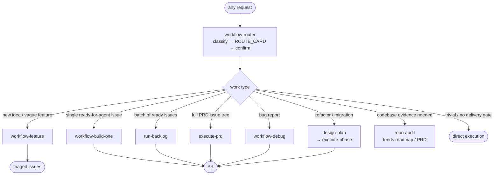
```mermaid
flowchart TD
    IN([any request]) --> R[workflow-router\nclassify → ROUTE_CARD → confirm]

    R --> C{work type}

    C -->|new idea / vague feature| WF[workflow-feature]
    C -->|single ready-for-agent issue| WB[workflow-build-one]
    C -->|batch of ready issues| RB[run-backlog]
    C -->|bug report| WD[workflow-debug]
    C -->|full PRD issue tree| EP[execute-prd]
    C -->|refactor / migration| DP[design-plan\n→ execute-phase]
    C -->|codebase evidence needed| RA[repo-audit\nfeeds roadmap / PRD]
    C -->|trivial / no delivery gate| DIR([direct execution])

    WF --> TRIAGE([triaged issues])
    WB --> PR([PR])
    RB --> PR
    EP --> PR
    WD --> PR
    DP --> PR
```

---

## Feature Development: `workflow-feature`

Turns a vague idea into triaged, ready-to-implement issues. **Stops before implementation** — produces the work, doesn't execute it.

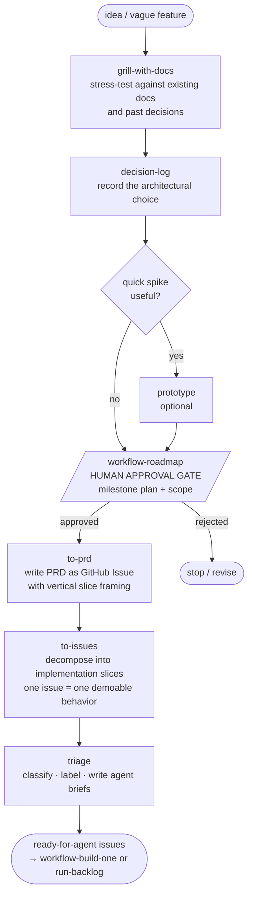
```mermaid
flowchart TD
    A([idea / vague feature]) --> B

    B[grill-with-docs\nstress-test against existing docs\nand past decisions]
    B --> C[decision-log\nrecord the architectural choice]
    C --> D{quick spike\nuseful?}
    D -->|yes| E[prototype\noptional]
    D -->|no| F
    E --> F

    F[/workflow-roadmap\nHUMAN APPROVAL GATE\nmilestone plan + scope/]
    F -->|approved| G
    F -->|rejected| STOP([stop / revise])

    G[to-prd\nwrite PRD as GitHub Issue\nwith vertical slice framing]
    G --> H[to-issues\ndecompose into implementation slices\none issue = one demoable behavior]
    H --> I[triage\nclassify · label · write agent briefs]
    I --> OUT([ready-for-agent issues\n→ workflow-build-one or run-backlog])
```

---

## Building One Thing: `workflow-build-one`

The standard workhorse. Drives a single `ready-for-agent` issue from a clean worktree to a merged PR.

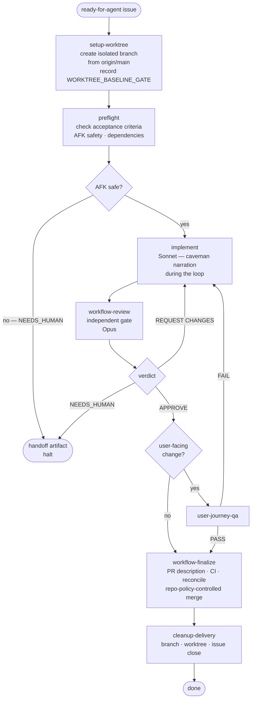
```mermaid
flowchart TD
    A([ready-for-agent issue]) --> B[setup-worktree\ncreate isolated branch\nfrom origin/main\nrecord WORKTREE_BASELINE_GATE]
    B --> C[preflight\ncheck acceptance criteria\nAFK safety · dependencies]
    C --> D{AFK safe?}
    D -->|no — NEEDS_HUMAN| HAND([handoff artifact\nhalt])
    D -->|yes| F

    F[implement\nSonnet — caveman narration\nduring the loop]
    F --> G

    G[workflow-review\nindependent gate\nOpus]
    G --> H{verdict}
    H -->|REQUEST CHANGES| F
    H -->|NEEDS_HUMAN| HAND
    H -->|APPROVE| I

    I{user-facing\nchange?}
    I -->|yes| J[user-journey-qa]
    I -->|no| K
    J -->|PASS| K
    J -->|FAIL| F

    K[workflow-finalize\nPR description · CI · reconcile\nrepo-policy-controlled merge]
    K --> L[cleanup-delivery\nbranch · worktree · issue close]
    L --> DONE([done])
```

**Model split**: implementation runs on Sonnet (fast). Review runs on Opus (judgment-heavy). Narration during the implementation loop is compressed ("caveman mode") — terse, no filler. Full prose returns for findings, blockers, and the final summary.

---

## AFK Batch: `run-backlog`

Batch-processes all `ready-for-agent` issues without human supervision.

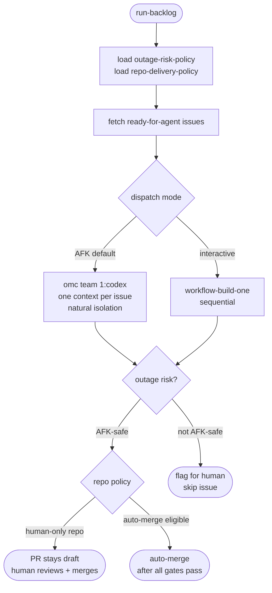
```mermaid
flowchart TD
    A([run-backlog]) --> B[load outage-risk-policy\nload repo-delivery-policy]
    B --> C[fetch ready-for-agent issues]
    C --> D{dispatch mode}

    D -->|AFK default| E[omc team 1:codex\none context per issue\nnatural isolation]
    D -->|interactive| F[workflow-build-one\nsequential]

    E --> GATE
    F --> GATE

    GATE{outage risk?}
    GATE -->|AFK-safe| POL{repo policy}
    GATE -->|not AFK-safe| HAND([flag for human\nskip issue])

    POL -->|human-only repo| DRAFT([PR stays draft\nhuman reviews + merges])
    POL -->|auto-merge eligible| AUTO([auto-merge\nafter all gates pass])
```

Each issue gets its own context window via Codex dispatch — no cross-contamination between issues. The `outage-risk-policy` file (per-repo) determines AFK safety; a `priority` label cannot override it.

---

## Full PRD Tree: `execute-prd`

Drives an entire PRD from analysis through delivery — handles dependent, ordered, parent-aware execution.

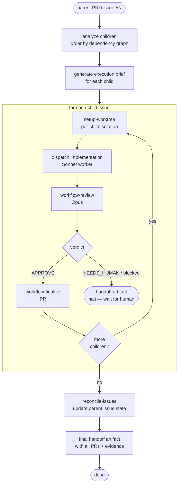
```mermaid
flowchart TD
    A([parent PRD issue #N]) --> B[analyze children\norder by dependency graph]
    B --> C[generate execution brief\nfor each child]

    C --> LOOP

    subgraph LOOP [for each child issue]
        D[setup-worktree\nper-child isolation]
        D --> E[dispatch implementation\nSonnet worker]
        E --> F[workflow-review\nOpus]
        F --> G{verdict}
        G -->|APPROVE| H[workflow-finalize\nPR]
        G -->|NEEDS_HUMAN / blocked| HAND([handoff artifact\nhalt — wait for human])
        H --> NEXT{more\nchildren?}
        NEXT -->|yes| D
    end

    NEXT -->|no| I[reconcile-issues\nupdate parent issue state]
    I --> J[final handoff artifact\nwith all PRs + evidence]
    J --> DONE([done])
```

Each child issue gets its own worktree — parallel or sequential depending on dependencies. Every halt produces a handoff artifact that a fresh session can resume from cold.

---

## Bug Work: `workflow-debug`

Cardinal rule: **all bug work begins with `diagnose`**, no exceptions — even if the fix is obvious.

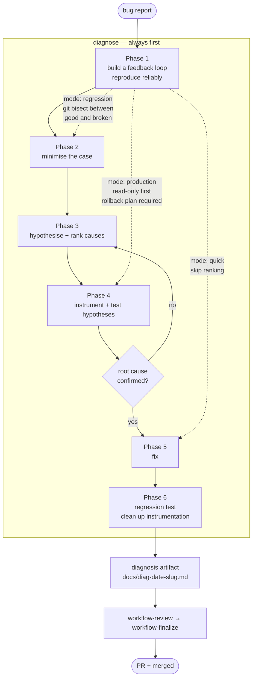
```mermaid
flowchart TD
    A([bug report]) --> B

    subgraph DIAG [diagnose — always first]
        B[Phase 1\nbuild a feedback loop\nreproduce reliably]
        B --> C[Phase 2\nminimise the case]
        C --> D[Phase 3\nhypothesise + rank causes]
        D --> E[Phase 4\ninstrument + test hypotheses]
        E --> F{root cause\nconfirmed?}
        F -->|no| D
        F -->|yes| G[Phase 5\nfix]
        G --> H[Phase 6\nregression test\nclean up instrumentation]
    end

    H --> ART[diagnosis artifact\ndocs/diag-date-slug.md]
    ART --> WR[workflow-review → workflow-finalize]
    WR --> DONE([PR + merged])

    B -.->|mode: quick\nskip ranking| G
    B -.->|mode: production\nread-only first\nrollback plan required| E
    B -.->|mode: regression\ngit bisect between\ngood and broken| C
```

The diagnosis artifact is evidence — it proves understanding and prevents wrong fixes. Modes: **quick** (single likely cause), **standard** (full loop), **deep** (extended instrumentation), **production** (read-only first, rollback required), **regression** (bisect from known-good).

---

## Review + Delivery

`workflow-review` and `workflow-finalize` are mandatory for every code change. Green CI, GitHub reviews, and PR comments do not substitute.

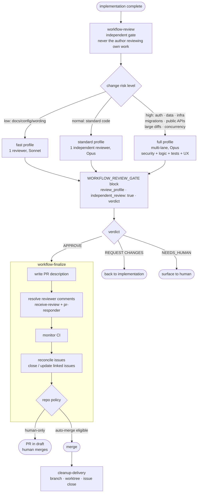
```mermaid
flowchart TD
    A([implementation complete]) --> B[workflow-review\nindependent gate\nnever the author reviewing own work]

    B --> RISK{change risk level}
    RISK -->|low: docs/config/wording| FAST[fast profile\n1 reviewer, Sonnet]
    RISK -->|normal: standard code| STD[standard profile\n1 independent reviewer, Opus]
    RISK -->|high: auth · data · infra\nmigrations · public APIs\nlarge diffs · concurrency| FULL[full profile\nmulti-lane, Opus\nsecurity + logic + tests + UX]

    FAST --> GATE[WORKFLOW_REVIEW_GATE block\nreview_profile · independent_review: true · verdict]
    STD --> GATE
    FULL --> GATE

    GATE --> V{verdict}
    V -->|REQUEST CHANGES| IMPL([back to implementation])
    V -->|NEEDS_HUMAN| HUMAN([surface to human])
    V -->|APPROVE| FIN

    subgraph FIN [workflow-finalize]
        F1[write PR description]
        F1 --> F2[resolve reviewer comments\nreceive-review + pr-responder]
        F2 --> F3[monitor CI]
        F3 --> F4[reconcile issues\nclose / update linked issues]
        F4 --> POL{repo policy}
    end

    POL -->|human-only| DRAFT([PR in draft\nhuman merges])
    POL -->|auto-merge eligible| MERGE([merge])
    MERGE --> CLEAN[cleanup-delivery\nbranch · worktree · issue close]
```

**workflow-finalize will not proceed** without a complete `WORKFLOW_REVIEW_GATE` block from an independent reviewer with `verdict: APPROVE`. If the change was made in the primary checkout instead of a worktree, it also halts.

---

## Handling Incoming Review: `receive-review` + `pr-responder`

When review comments land (bot or human), two skills work through the queue.

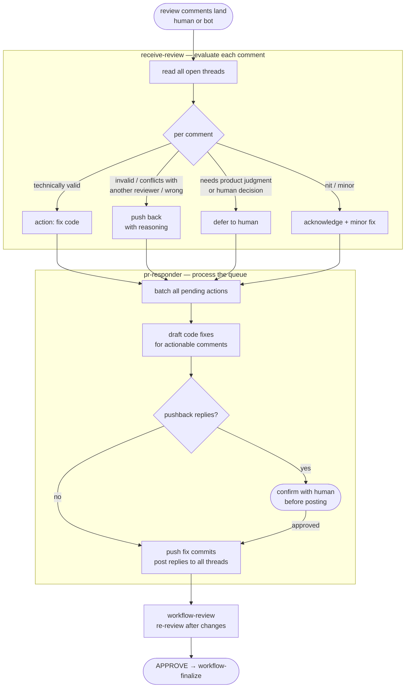
```mermaid
flowchart TD
    A([review comments land\nhuman or bot]) --> B

    subgraph RR [receive-review — evaluate each comment]
        B[read all open threads]
        B --> C{per comment}
        C -->|technically valid| ACT[action: fix code]
        C -->|invalid / conflicts with\nanother reviewer / wrong| PB[push back\nwith reasoning]
        C -->|needs product judgment\nor human decision| DEF[defer to human]
        C -->|nit / minor| NIX[acknowledge + minor fix]
    end

    ACT --> Q
    PB --> Q
    DEF --> Q
    NIX --> Q

    subgraph PR2 [pr-responder — process the queue]
        Q[batch all pending actions]
        Q --> R[draft code fixes\nfor actionable comments]
        R --> S{pushback replies?}
        S -->|yes| CONF([confirm with human\nbefore posting])
        S -->|no| T
        CONF -->|approved| T
        T[push fix commits\npost replies to all threads]
    end

    T --> U[workflow-review\nre-review after changes]
    U --> V([APPROVE → workflow-finalize])
```

`receive-review` evaluates correctness — it doesn't blindly agree. Suggestions that are technically wrong, conflict with other reviewers, or contradict project invariants get a reasoned pushback. Human reviewer disagreements surface to Alex before any reply goes out.

---

## Architecture + Codebase Work

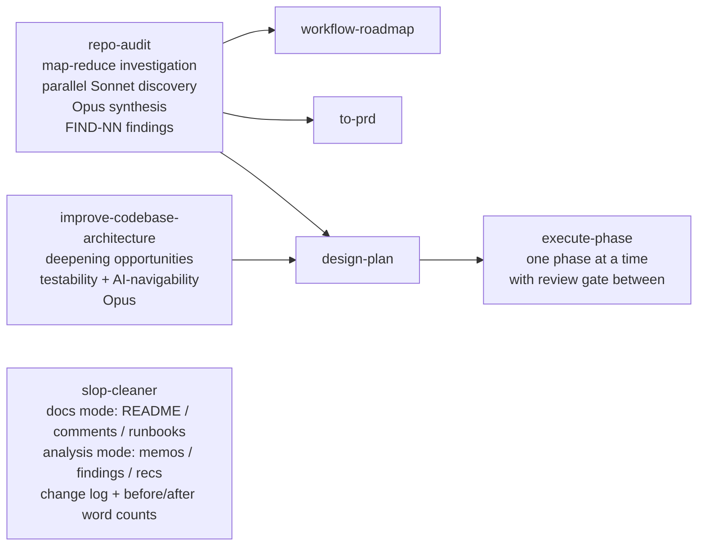
```mermaid
flowchart LR
    RA[repo-audit\nmap-reduce investigation\nparallel Sonnet discovery\nOpus synthesis\nFIND-NN findings]

    RA --> RD[workflow-roadmap]
    RA --> PRD[to-prd]
    RA --> DP[design-plan]

    ICA[improve-codebase-architecture\ndeepening opportunities\ntestability + AI-navigability\nOpus]
    ICA --> DP

    DP --> EP2[execute-phase\none phase at a time\nwith review gate between]

    SC[slop-cleaner\ndocs mode: README / comments / runbooks\nanalysis mode: memos / findings / recs\nchange log + before/after word counts]
```

---

## Handoff: Universal Exit Protocol

Every workflow that halts with remaining work produces a **handoff artifact**. The handoff is what makes AFK execution recoverable — a fresh session can resume without rebuilding context.

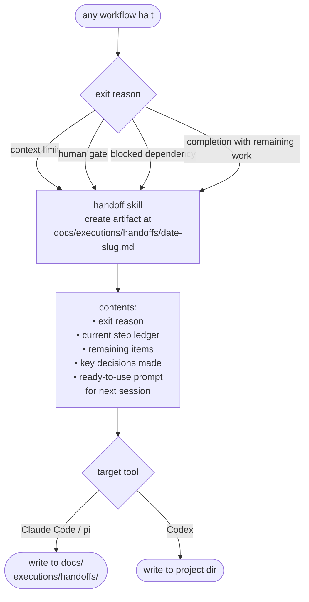
```mermaid
flowchart TD
    ANY([any workflow halt]) --> WHY{exit reason}
    WHY -->|context limit| H
    WHY -->|human gate| H
    WHY -->|blocked dependency| H
    WHY -->|completion with remaining work| H

    H[handoff skill\ncreate artifact at\ndocs/executions/handoffs/date-slug.md]

    H --> CONTENTS["contents:\n• exit reason\n• current step ledger\n• remaining items\n• key decisions made\n• ready-to-use prompt\n  for next session"]

    CONTENTS --> TARGET{target tool}
    TARGET -->|Claude Code / pi| CLAUDE([write to docs/\nexecutions/handoffs/])
    TARGET -->|Codex| CODEX([write to project dir])
```

---

## Worktrees: Isolation Pattern

Every implementation runs in an isolated git worktree. `workflow-finalize` enforces this — it halts if the change was made in the primary checkout.

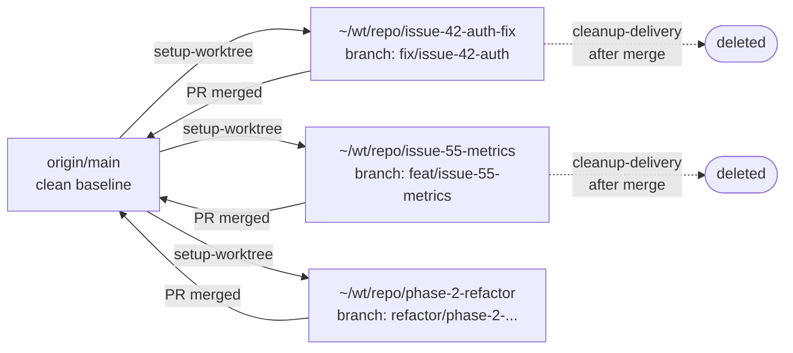
```mermaid
flowchart LR
    MAIN[origin/main\nclean baseline]

    MAIN -->|setup-worktree| WT1[~/wt/repo/issue-42-auth-fix\nbranch: fix/issue-42-auth]
    MAIN -->|setup-worktree| WT2[~/wt/repo/issue-55-metrics\nbranch: feat/issue-55-metrics]
    MAIN -->|setup-worktree| WT3[~/wt/repo/phase-2-refactor\nbranch: refactor/phase-2-...]

    WT1 -->|PR merged| MAIN
    WT2 -->|PR merged| MAIN
    WT3 -->|PR merged| MAIN

    WT1 -.->|cleanup-delivery\nafter merge| DEL1([deleted])
    WT2 -.->|cleanup-delivery\nafter merge| DEL2([deleted])
```

Each worktree records `WORKFLOW_BASE_GATE` + `WORKTREE_BASELINE_GATE` evidence before the first code change. Stacked worktrees (child branch targeting a parent branch) are allowed — `workflow-finalize` checks for `STACKED_WORKTREE_GATE` instead.

---

## Part 2 — What's Installed & Where

## Repo Layout

Everything lives in `~/dotdev`. One repo, two concerns:

```
~/dotdev/
  Brewfile                  # all Homebrew formulae + casks (source of truth)
  install.sh                # idempotent bootstrap — safe to re-run
  dotfiles/                 # stowed with GNU Stow → $HOME
    .zshrc
    .gitconfig
    .gitignore_global
    .claude/                # Claude-SPECIFIC config (no skills/ here — retired)
      hooks/                # workflow-guard.sh, herdr-agent-state.sh, etc.
      settings.json         # shared Claude config (hooks, plugins, permissions)
      settings.local.template.json  # machine-local template (gbrain MCP)
    .pi/                    # pi-specific config (reads shared skills via ~/.claude/skills)
    .config/
      agents/               # AGENT-AGNOSTIC shared source (name-neutral)
        skills/             # 98 skills — single source of truth for all agents
                            #   ~/.claude/skills → here, symlinked by ai-setup.sh (not stow)
        docs/               # shared agent reference
      ...                   # zsh, starship, lazygit, cursor, arc, raycast, herdr, etc.
  scripts/
    ai-setup.sh             # guardian clone, pi packages, gbrain clone
    brew.sh                 # Homebrew bootstrap
    github.sh               # SSH key + gh auth
    herdr-setup.sh          # herdr integrations + plugins
    config-init.sh          # pre-creates dirs to prevent stow tree-folding
    macos/                  # per-surface macOS defaults
    hdev.sh, hlog.sh        # herdr workspace launchers
    arc.sh                  # Arc bookmark backup/restore
    security-init.sh        # git-secrets install
```

**GNU Stow** manages all symlinks: `stow -d ~/dotdev -R -t $HOME dotfiles`. Every file under `dotfiles/` lands at the same relative path under `$HOME`.

---

## Fresh Install

```bash
git clone git@github-personal:johnalexwelch/dotdev.git ~/dotdev
cd ~/dotdev && bash install.sh
# DRY_RUN=1 bash install.sh   → preview every command without executing
```

`install.sh` runs in order:

1. **`brew.sh`** — installs Homebrew if missing; runs `brew bundle --file=Brewfile`
2. **`config-init.sh`** — pre-creates `~/.config/{ghostty,lazygit,mcp,nvim,raycast,gh-dash,zsh,...}` so Stow can't tree-fold them
3. **`github.sh`** — generates `~/.ssh/id_ed25519`, adds to agent + keychain, authenticates with `gh`
4. **`gh-extensions.sh`** — installs `gh` CLI extensions
5. **Application symlinks** — `~/.config/arc → ~/Library/Application Support/Arc` etc. (Arc, Cursor, StreamDeck)
6. **macOS defaults** — `defaults.sh`, `finder.sh`, `dock.sh`, `spotlight.sh`, `terminal.sh`, `screen.sh`, `input_devices.sh`, `permissions.sh`
7. **`stow`** — materializes all `dotfiles/` symlinks into `$HOME`
8. **`ai-setup.sh`** — guardian clone + compile, gbrain clone, pi packages, `~/.claude/skills` symlink, pi checkpoint-prune LaunchAgent
9. **`herdr-setup.sh`** — herdr integrations + plugins

One manual step post-install: `~/.claude/settings.local.json` is created from template — contains the gbrain MCP path.

---

## Shell — ZSH

Minimal, modular, **no oh-my-zsh**. Modules load in order: configs → tools → theme.

### `.zshrc` (thin loader)

```zsh
XDG_CONFIG_HOME="$HOME/.config"
ZSH_CONFIG="$XDG_CONFIG_HOME/zsh"

# Load configs/  tools/  themes/ in order
for conf in "$ZSH_CONFIG/configs"/*.zsh; do source "$conf"; done
for conf in "$ZSH_CONFIG/tools"/*.zsh;   do source "$conf"; done
source "$ZSH_CONFIG/themes/starship.zsh"
eval "$(zoxide init zsh)"
```

Then: pin Node 22 LTS, load `GITHUB_MCP_PAT` from launchctl, Cargo PATH, bun, safe-chain, and the `idea`/`ideas` functions.

### Configs (`~/.config/zsh/`)

| File | What it does |
|---|---|
| `configs/aliases.zsh` | Modern CLI rewrites (`eza`, `bat`, `rg`, `fd`, `htop`, `dust`, `duf`) + nav shortcuts + git/docker/data aliases + `hdev`/`hlog`/project shortcuts |
| `configs/env.zsh` | XDG dirs, `~/bin`, `.local/bin`, Homebrew, Cursor PATH; sources credential files (`~/.anthropic`, `~/.openai`, `~/.slack`, etc.); CORA vars; GitHub MCP token alias |
| `configs/history.zsh` | 50k HISTSIZE/SAVEHIST; dedup + reduce-blanks opts; **atuin** init (cross-session SQLite, Ctrl-R) with native up-arrow fallback |
| `configs/plugins.zsh` | zsh-autosuggestions + zsh-syntax-highlighting config vars (installed via Brewfile, sourced separately) |
| `configs/aws.zsh` | SSO helpers: `awsl` (login + set profile), `awsp` (switch profile), `aws-profiles`, `aws-sso-token`, `aws-sso-accounts` |
| `tools/git.zsh` | 40+ git aliases (`gs`, `glog`, `gpf`, etc.) + fzf-powered `ga-fzf`, `gco-fzf`, `gh-fzf`; `gnb` (branch + push -u), `gclean` (prune merged) |
| `tools/python.zsh` | pyenv init, virtualenv helpers |

### Key Aliases

```zsh
ls   → eza --color --git --icons
cat  → bat
grep → rg
find → fd
j    → z (zoxide)          # frecency-based directory jump
code → cursor
vim  → nvim
top  → htop
du   → dust
df   → duf
```

**Prompt**: Starship (`~/.config/starship/starship.toml`), `eval "$(starship init zsh)"`.

---

## Git

`~/.gitconfig` (stowed):

- **Editor**: `code --wait` (opens Cursor)
- **Pager**: `delta` with side-by-side diffs, line numbers, navigation (`n`/`N`)
- **Default branch**: `main`
- **push**: `autoSetupRemote = true`, `default = current`
- **pull**: `rebase = true` · **fetch**: `prune = true` · **rebase**: `autoStash = true`
- **Global gitignore** (`~/.gitignore_global`): macOS system files, `.DS_Store`, VSCode/JetBrains dirs, Python/JS/TS artifacts, `.env*`, AWS credentials, Terraform state, `.omc/`, `.serena/`, `**/.claude/settings.local.json`

### Conventional Commits

`dotfiles/.config/git/commit-normalize.sh` — normalizes commit messages to Conventional Commits format. Two delivery paths:

1. **Pre-commit hook** — via `.pre-commit-config.yaml` (`stages: [commit-msg]`) when `pre-commit install` is run in a repo
2. **Manual** — `~/.config/git/commit-msg` searches for the script (same dir → XDG git dir → dotfiles path) when copied to a repo's `.git/hooks/`

---

## Claude Code config

### `settings.json` (stowed → `~/.claude/settings.json`)

**Model**: `opus` (claude-opus-4-5). Extended thinking always on (`alwaysThinkingEnabled`, `effortLevel: high`). Advisor model: `opus`.

**Permissions (allow all by default)**:

```
Bash(*), Read, Write, Edit, Glob, Grep, LS, WebFetch, WebSearch,
Agent, Monitor, SendMessage, Skill(*), LSP,
TeamCreate/Delete, RemoteTrigger, CronCreate/Delete/List,
EnterPlanMode/ExitPlanMode, EnterWorktree/ExitWorktree,
AskUserQuestion, NotebookEdit/Read, Task*
```

**Hard denies**: `sudo *`, `git push --force *`, `git push -f *`, `rm -rf / *`, `rm -rf ~*`. `defaultMode: auto`.

**Env vars injected into every session**:

- `CLAUDE_CODE_EXPERIMENTAL_AGENT_TEAMS=1` — enables multi-agent team features
- `LANGFUSE_HOST=http://192.168.4.43:3050` + `TRACE_TO_LANGFUSE=true` — traces to home-network Langfuse

**TUI**: fullscreen. Notifications: Ghostty. Teammate mode: tmux.

### Guardian (exact)

**Location**: `~/.claude/guardian/` — cloned from `github-personal:johnalexwelch/guardian`; TypeScript compiled to `dist/cli.js` by tsc. **Runtime**: `run.sh` is a thin wrapper — `exec node ~/.claude/guardian/dist/cli.js` (no tsx/JIT). **Deps**: `@anthropic-ai/sdk`, `zod`, `typescript`. Falls back to `ask` mode if `ANTHROPIC_API_KEY` is unset. (Behavior described in Part 1.)

### Workflow Guard (`~/.claude/hooks/workflow-guard.sh`, pure Bash)

- **PreToolUse**: blocks `gh issue create/edit` from being labeled `ready-for-agent` if the body looks like a PRD ("PRD", "spec", "User Stories", etc.). PRD-parents stay labeled as such; child implementation issues get the label.
- **PostToolUse**: `gh issue create/edit + ready-for-agent` → checklist reminder (acceptance criteria, rollback, AFK/HITL, gates); `gh pr create/ready` → warns not to claim CI success from exit code alone + checks WORKFLOW gates; `gh pr merge/close` → runs `git status` + `git worktree list`, tells agent to load `cleanup-delivery`.

### PostToolUse on every `Edit`/`Write`

1. **Linter/formatter** — `ruff check --fix` + `ruff format` for `.py`; `npx eslint --fix` for `.ts/.tsx`
2. **Secret scanner** — greps for `sk-*`, `AKIA*`, private key headers, `password=` literals; prints `WARNING`
3. **File size guard** — warns above 300 lines
4. **Guardian recompile** — if the file is `~/.claude/guardian/*.ts`, runs `npx tsc` (30s timeout)

### SessionStart hooks

1. **herdr agent-state** — notifies herdr server of session start (pane tracking). No-ops if herdr isn't running.
2. **journey hook propagation** — copies `60-journey.sh` into any `remember` plugin hook dirs missing it (idempotent).

### Status line (HUD)

Bottom status bar driven by **oh-my-claudecode**:

```
sh ${CLAUDE_CONFIG_DIR:-$HOME/.claude}/hud/omc-hud-cache.sh \
   ${CLAUDE_CONFIG_DIR:-$HOME/.claude}/hud/omc-hud.mjs
```

Shows token usage, model, session info. Cache-backed — only re-reads state on change.

### Enabled plugins

| Plugin | Purpose |
|---|---|
| `agent-sdk-dev` | Agent SDK development helpers |
| `claude-md-management` | `CLAUDE.md` / context file management |
| `code-simplifier` | Complexity + simplification suggestions |
| `context7` | Up-to-date library docs via Context7 |
| `data-engineering` | Data pipeline + SQL tooling |
| `frontend-design` | UI/design guidance |
| `git-cleanup` (trailofbits) | Dead branch + stale ref cleanup |
| `oh-my-claudecode` (omc) | HUD status line, session telemetry, team dispatch |
| `playwright` | Browser test generation + execution |
| `plugin-dev` | Plugin authoring scaffolding |
| `pyright-lsp` | Python LSP via Pyright |
| `remember` | Persistent session memory |
| `skill-creator` | New skill scaffolding |
| `slack` | Slack integration |
| `superpowers` | Extended tool capabilities |
| `typescript-lsp` | TypeScript LSP + diagnostics |

Disabled but installed: `code-review`, `commit-commands`, `feature-dev`, `figma`, `ralph-loop`, `security-guidance`, `serena`, `zeroize-audit`.

### `settings.local.json` + gbrain

Machine-local, not stowed. Generated from `settings.local.template.json` on first `ai-setup.sh` run. Contains only the **gbrain** MCP server — a local knowledge-graph / second-brain server cloned to `~/gbrain-repo`, run via bun:

```json
{
  "mcpServers": {
    "gbrain": {
      "command": "/Users/alexwelch/.bun/bin/bun",
      "args": ["/Users/alexwelch/gbrain-repo/src/mcp/server.ts"]
    }
  }
}
```

### Skills inventory (by category)

`~/.config/agents/skills/` — **98 skills**. Examples:

- **Product / strategy**: `analysis-council`, `analysis-design`, `okr-generator`, `v1-idea-grill`, `v1-system-design`, `strategic-analysis-review`, `experiment-design`, `metric-council`, `metric-design`
- **Engineering**: `tdd`, `implement`, `diagnose`, `workflow-debug`, `workflow-feature`, `workflow-finalize`, `workflow-review`, `run-backlog`, `pr-responder`, `pr-review`, `repo-audit`, `slop-cleaner`, `sql-review`, `lineage-audit`
- **Docs / content**: `decision-log`, `decision-memo`, `handoff`, `humanizer`, `clarity-review`, `runbook-author`, `post-mortem`, `incident-retro`, `slack-update`
- **Data**: `data-quality-audit`, `data-readiness-check`, `mock-data-generator`
- **Agent / CHORUS ops**: `brain-ops`, `to-issues`, `to-prd`, `triage`, `herdr-launch`, `execute-prd`, `execute-phase`, `setup-worktree`
- **UI / design**: `dashboard-design`, `dashboard-review`, `prototype`, `stage-v1-concept`

---

## Pi Agent config

Stowed from `dotfiles/.pi/agent/settings.json` → `~/.pi/agent/settings.json`. **Default provider**: anthropic. **Default model**: claude-sonnet-5.

### Packages (26)

**Codebase navigation**

- `pi-codemapper` — indexes the codebase (symbols, call graphs, dependencies); `map`, `search`, `outline`, `expand`, `path`
- `pi-lens` — LSP diagnostics, ast-grep structural search, tree-sitter rules; runs against the live language server

**Subagent orchestration**

- `pi-fork` — spawns subagents at configurable effort levels (fast/balanced/deep → haiku/sonnet/opus)
- `pi-taskflow` — orchestrates multi-agent DAGs (parallel branches, sequential chains, gated phases, map-reduce)

**Memory + context**

- `pi-observational-memory` — compresses session learnings into cross-session observations; runs on haiku
- `pi-context-cap` — warns approaching context limits
- `pi-context-inspector` — shows context composition

**Guardrails**

- `pi-dirty-repo-guard` — blocks writes on repos with uncommitted changes
- `pi-permission-gate` — confirmation prompts for destructive operations
- `pi-codex-goal` — tracks a concrete objective through multi-turn sessions

**Output efficiency** — three-stage compression stack (composable, NOT redundant)

- `pix-optimizer` — stage 1, pre-exec (`before_agent_start`): prompt guidance telling the model to pipe dense JSON through `jq | toon`; also hosts the caveman/ponytail personas + RTK. Does no automated compression itself — guidance only.
- `pi-hypa` — stage 2, at-exec (`tool_call` on bash): rewrites the bash command to route through `hypa -c`, deterministically compressing shell/read/grep/find/ls output locally (no LLM, no network; 186M native binary)
- `pi-extension-headroom` — stage 3, pre-LLM (`context`): LLM-compresses large `toolResult` messages (≥2000 chars) via a local proxy on `127.0.0.1:8788`, and only once context usage ≥20k tokens
- `pi-cache-optimizer` — prompt cache optimization
- `pi-better-messages-cache` — message-level caching

> **Do not prune these as "redundant compressors."** Verified 2026-07-29 by reading each extension's hooks: they act at three distinct pipeline stages (prompt guidance → deterministic shell-output compression → LLM context compression), operate on different bytes, and cascade rather than double-compress. Removing one is a real capability loss, not de-duplication. The only genuine cost is `pi-hypa`: a per-bash-call spawn tax (`hypa rewrite` + `hypa -c`, 5s timeout each) and a habit of mangling compound shell commands — it splits on `;` and breaks `{ }` blocks / heredocs, so multi-statement bash may need a script-file workaround. That is a correctness/friction tradeoff to weigh on hypa's own merits, not a redundancy argument.

**Real-world integration**

- `pi-web-access` — web search and fetch
- `pi-agent-browser-native` — real Playwright-backed browser automation
- `pi-mcp-adapter` — MCP protocol bridge
- `@gotgenes/pi-github-tools` — GitHub MCP tools
- `pi-pr-ally` — PR review and response assistance
- `@diegopetrucci/pi-triage-comments` — comment triage

**Utility / display**

- `pi-tool-display` — richer tool result rendering
- `pi-observability` — session observability
- `@narumitw/pi-caffeinate` — prevents macOS sleep during long AFK runs
- `@diegopetrucci/pi-notify` — macOS notifications when the agent needs input or completes

### modelRoles

```json
{
  "fast":     "anthropic/claude-haiku-4-5",
  "strong":   "anthropic/claude-sonnet-4-6",
  "thinker":  "anthropic/claude-sonnet-4-6",
  "arbiter":  "anthropic/claude-opus-4-5",
  "vision":   "anthropic/claude-sonnet-4-6",
  "reasoner": "anthropic/claude-opus-4-5"
}
```

| Role | Model | Used for |
|---|---|---|
| fast | claude-haiku-4-5 | Quick lookups, memory compression, subagent fast mode |
| strong / thinker / vision | claude-sonnet-4-6 | Normal exploration, implementation, most subagent work |
| arbiter / reasoner | claude-opus-4-5 | Review, architecture decisions, high-stakes judgment |

### Fork effort → model

| Effort | Model | Thinking |
|---|---|---|
| `fast` | claude-haiku-4-5 | off |
| `balanced` (default) | claude-sonnet-4-6 | low |
| `deep` | claude-opus-4-5 | medium |

Observational memory compression runs on haiku-4-5 (cheap, high-frequency).

---

## Herdr: Workspace Layout + Sessions

**herdr** is a terminal multiplexer + agent session manager. The `hdev` command creates a structured workspace:

```bash
hdev ~/projects/myapp            # full layout
hdev ~/projects/myapp --monitor  # gh-dash only
hdev ~/projects/myapp --minimal  # pi only
```

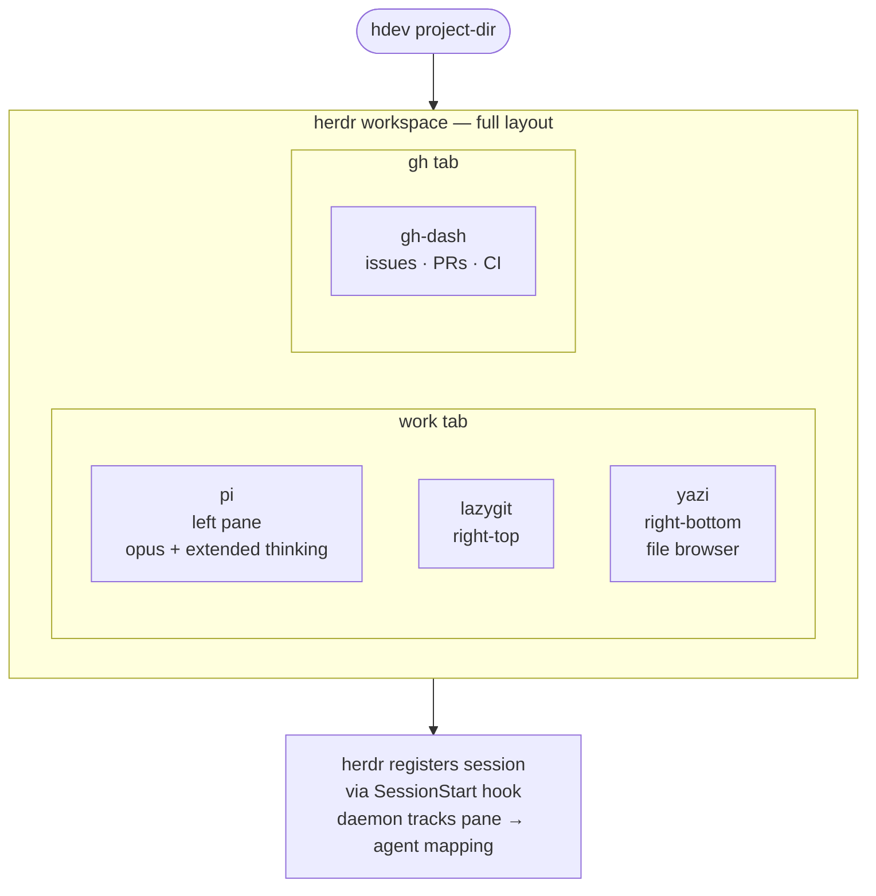
```mermaid
flowchart TD
    subgraph WS [herdr workspace — full layout]
        subgraph WORK [work tab]
            PI[pi\nleft pane\nopus + extended thinking]
            LG[lazygit\nright-top]
            YZ[yazi\nright-bottom\nfile browser]
        end
        subgraph GH [gh tab]
            DASH[gh-dash\nissues · PRs · CI]
        end
    end

    START([hdev project-dir]) --> WS
    WS --> SESSION[herdr registers session\nvia SessionStart hook\ndaemon tracks pane → agent mapping]
```

Integrations + plugins installed by `herdr-setup.sh`:

| Integration | What it does |
|---|---|
| `pi` / `claude` / `codex` / `opencode` | Registers each agent's sessions in herdr's pane registry |

- `persiyanov/herdr-fresh-worktree` — creates clean worktrees pre-attached to herdr panes
- `cloudmanic/herdr-plus` — extended herdr utilities

Launchers: `hdev <path>` (workspace), `hlog <path>` (log-focused); `chorus`, `cora`, `mira` are project shortcuts. The `herdr-agent-state.sh` SessionStart hook reports session-open events to the daemon over a UNIX socket; no-ops silently if the daemon isn't running.

---

## Idea Capture

```bash
idea "build a metrics alerting layer"   # AI-enriched capture
idea -q "quick note"                    # skip enrichment
```

Calls claude-haiku-4-5 to classify (tool/app/research/business/experiment/...), write a one-sentence pitch, generate tags, and suggest 3 concrete next steps. Result lands as structured frontmatter Markdown in `~/Documents/Home/Idea Bin/`. `ideas review` and `ideas promote` move ideas through the downstream pipeline.

---

## Observability

**Langfuse** at `192.168.4.43:3050` (home network) receives traces from every Claude session — token usage, tool calls, session duration, model spend. **pi-observational-memory** produces per-session compressed observations that persist across context resets — a navigable log of what was learned, decided, and done.

---

## Homebrew

~230 formulae installed (`Brewfile` is source of truth). Highlights:

- **CLI modernization**: `eza`, `bat`, `ripgrep`, `fd`, `fzf`, `delta`, `zoxide`, `atuin`, `dust`, `duf`, `htop`, `jq`, `yq`
- **Shell**: `zsh-autosuggestions`, `zsh-syntax-highlighting`, `starship`, `tmux`, `tree`
- **Dev**: `git`, `gh`, `gitmoji`, `pre-commit`, `uv`, `bun`, `node@22`, `python`, `rust`, `go`, `nvim`, `lazygit`, `lazysql`
- **AI / agents**: `claude-cmd`, `herdr`
- **Cloud / infra**: `awscli`, `kubectl`, `k9s`, `terraform`, `ansible`, `docker`
- **Data**: `dbt`, `astro` (Astronomer CLI)
- **Security**: `git-secrets`, `gnupg`, `age`
- **Misc**: `ffmpeg`, `imagemagick`, `pandoc`, `watch`, `wget`, `curl`

Casks: Cursor, Arc, Ghostty, Raycast, Obsidian, Elgato Stream Deck, and others.

---

## Credentials

Flat files in `$HOME` (not stowed, not committed):

```
~/.anthropic  ~/.openai  ~/.slack  ~/.readwise  ~/.todoist  ~/.asana
~/.google  ~/.spotify  ~/.discord  ~/.redshift  ~/.metabase  ~/.trino
~/.chief-of-staff-env
```

`env.zsh` sources each if it exists (`[[ -f "$HOME/$cred" ]] && source ...`); missing files are silently skipped. Adding a service = drop a file, add its name to `env.zsh`'s loop. `GITHUB_MCP_PAT` lives in the macOS launchctl environment (`launchctl setenv`), read back with `launchctl getenv`. Nothing in the dotfiles repo ever touches a secret.

---

## macOS Defaults

Set by `scripts/macos/`:

| Script | What it configures |
|---|---|
| `defaults.sh` | General UI preferences (animations, scroll bars, etc.) |
| `finder.sh` | Show hidden files, path bar, status bar, default folder |
| `dock.sh` | Dock size, auto-hide, hot corners |
| `spotlight.sh` | Disables Spotlight indexing of `~/Code` and drives |
| `terminal.sh` | Sets Ghostty as default terminal |
| `screen.sh` | Screenshot save location → `~/Desktop/Screenshots` |
| `input_devices.sh` | Tap-to-click, natural scroll, fast key repeat |
| `permissions.sh` | Removes quarantine attributes from selected apps |

---

## CHORUS

`~/projects/legacy/chorus` — the connective tissue for the personal AI agent fleet.

**Agents**: Mira (COO/broker), Iris, Cora (infra), Cleo, Nora, Aria, Wren, Rowan.

**What CHORUS owns**: trust domains, wire contract (`protocol/`), guardian policy (`policy/`), permission layer (`guardian/`), health watchdog (`watchdog/`), runtime init (`scripts/init-runtime.sh`), agent registry (`registry.yaml`).

**Trust domains**: Work-confidential, Personal-confidential, Shared-safe, Public. Mira brokers cross-domain actions; agents operate autonomously within their tier, escalate to Mira for Tier-2 (routine-internal) or human for Tier-3+ (destructive / cross-domain).

---

## Notable Patterns

- **No oh-my-zsh** — removed; configs manually load only what's needed.
- **Stow tree-folding prevention** — `config-init.sh` pre-creates every target dir before stow runs. Without it, stow symlinks the whole directory rather than individual files, breaking apps that write into those dirs.
- **Guardian + pi in the same pipeline** — every Bash call goes through guardian (TypeScript LLM check, ~200ms hot) *then* pi executes. Guardian runs from precompiled `dist/cli.js`; `tsx` removed to eliminate the esbuild transitive vulnerability.
- **DRY_RUN everywhere** — every script checks `DRY_RUN=${DRY_RUN:-0}` and routes through a `run_cmd()` wrapper, so the full install sequence is auditable without touching the filesystem.
- **Credential sourcing** — flat files in `$HOME`, sourced lazily; nothing in the repo touches a secret.
- **settings.local.json** — the only machine-specific Claude config; generated once from template, never committed; contains only the gbrain MCP path.
